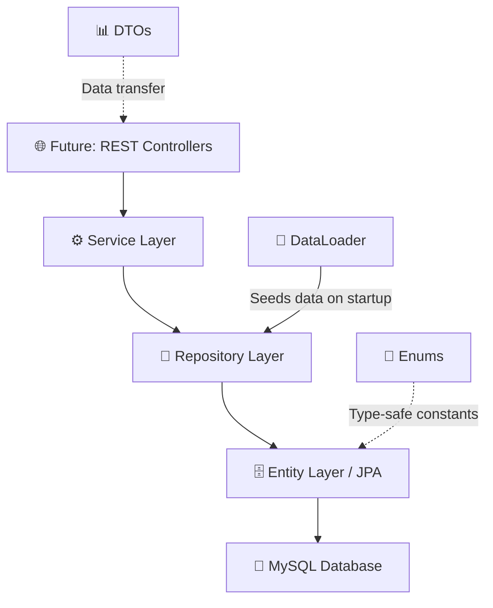
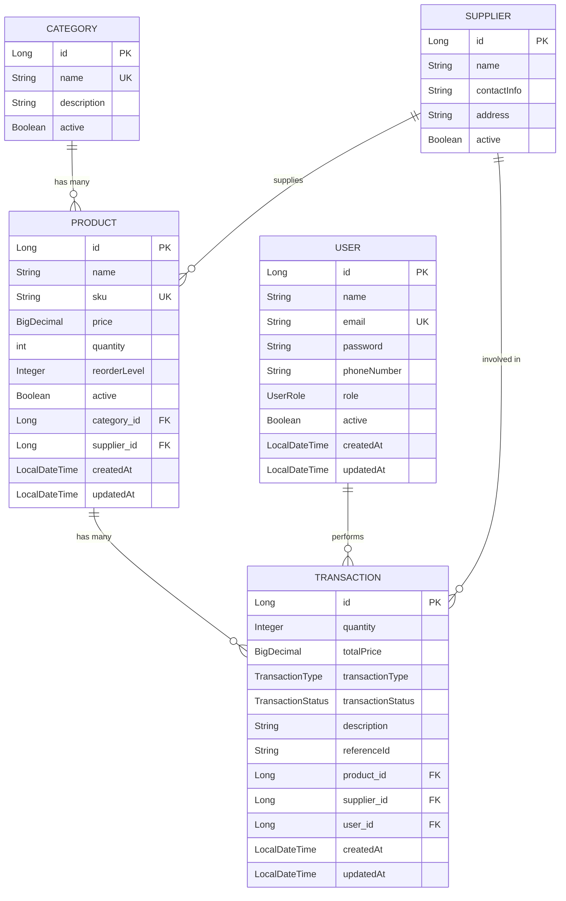
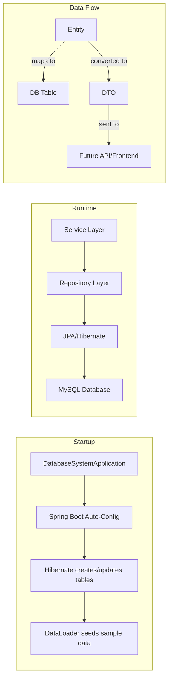

# 📦 Inventory Management & Reporting System — Complete Project Walkthrough

## 1. Project Overview

This is a **Spring Boot 3.5** backend application that implements the **database layer** for an Inventory Management and Reporting System. It uses **JPA (Hibernate)** as the ORM to map Java objects to a **MySQL** relational database.

The system manages **Products**, **Categories**, **Suppliers**, **Users**, and **Transactions** (sales, purchases, returns, adjustments) — with full CRUD operations, stock management, search/filter capabilities, and a reporting/dashboard module.

> [!NOTE]
> The project currently has **no REST controllers** — it exposes only the service layer and seeds sample data on startup via `DataLoader`. This means it's designed as a **database + business-logic layer** that a frontend or API layer can be built on top of.

---

## 2. Technology Stack

| Technology | Version | Purpose |
|---|---|---|
| **Java** | 21 | Programming language |
| **Spring Boot** | 3.5.12 | Application framework — auto-configuration, DI, embedded server |
| **Spring Data JPA** | (via starter) | ORM layer — maps Java entities to MySQL tables via Hibernate |
| **Hibernate** | (via JPA starter) | JPA implementation — generates SQL, manages entity lifecycle |
| **MySQL** | 8.x | Relational database |
| **Lombok** | (via dependency) | Reduces boilerplate — auto-generates getters, setters, builders, constructors |
| **Jakarta Validation** | (via starter) | Bean validation — `@NotBlank`, `@Email`, `@Positive`, etc. |
| **Spring Boot Actuator** | (via starter) | Health checks and monitoring endpoints |
| **HikariCP** | (default pool) | High-performance JDBC connection pool |
| **Maven** | (wrapper included) | Build tool & dependency management |

---

## 3. Architecture — Layered Pattern



The project follows the classic **Entity → Repository → Service** layered architecture:

| Layer | Package | Role |
|---|---|---|
| **Entity** | `entity/` | JPA-annotated classes that map to database tables |
| **Enum** | `enums/` | Type-safe constants for roles, statuses, types |
| **Repository** | `repository/` | Spring Data JPA interfaces for database access |
| **Service** | `service/` | Business logic — validation, stock management, reporting |
| **DTO** | `dto/` | Data Transfer Objects for API responses / reports |
| **Config** | `DataLoader.java` | Seeds the database with sample data on first run |

---

## 4. File-by-File Breakdown

### 4.1 Root / Build Files

---

#### [pom.xml](file:///c:/FUNNY/infosys/database-system/pom.xml)
**What it is:** Maven Project Object Model — the build configuration file.

**Why it matters:** This is the **heart of the build system**. It defines:
- **Parent**: `spring-boot-starter-parent` v3.5.12 — inherits dependency versions, plugin configs
- **Java version**: 21
- **6 dependencies**:

| Dependency | Purpose |
|---|---|
| `spring-boot-starter-data-jpa` | JPA + Hibernate + HikariCP for database operations |
| `spring-boot-starter-web` | Embedded Tomcat server, REST support |
| `spring-boot-starter-validation` | Jakarta Bean Validation (`@NotBlank`, `@Email`, etc.) |
| `mysql-connector-j` | JDBC driver to connect to MySQL (runtime only) |
| `lombok` | Compile-time annotation processor for boilerplate reduction |
| `spring-boot-starter-test` | JUnit 5, Mockito for testing |
| `spring-boot-starter-actuator` | Health/metrics endpoints at `/actuator` |

- **Plugins**: `maven-compiler-plugin` (configures Lombok annotation processing), `spring-boot-maven-plugin` (creates executable JAR)

---

#### [application.properties](file:///c:/FUNNY/infosys/database-system/src/main/resources/application.properties)
**What it is:** Spring Boot's central configuration file.

**Why it matters:** Configures **everything** about how the app connects to the database and behaves:

| Property | Value | Explanation |
|---|---|---|
| `server.port` | `8083` | App runs on port 8083 instead of default 8080 |
| `spring.datasource.url` | `jdbc:mysql://localhost:3306/inventory_db` | Connects to MySQL database named `inventory_db` |
| `spring.datasource.username` | `${DB_USERNAME:root}` | Uses env variable or defaults to `root` |
| `spring.datasource.password` | `2005` | Database password (hardcoded) |
| `spring.jpa.hibernate.ddl-auto` | `update` | Hibernate auto-creates/updates tables without dropping data |
| `spring.jpa.show-sql` | `true` | Prints SQL statements to console for debugging |
| `spring.jpa.open-in-view` | `false` | Disables lazy-loading in view layer (best practice) |
| HikariCP settings | pool-size: 10, min-idle: 5 | Connection pool tuning for performance |
| Hibernate batch settings | batch_size: 20 | Batches INSERT/UPDATE statements for efficiency |
| Logging levels | SQL=DEBUG, bind=TRACE | Shows exact SQL and parameter values in logs |

> [!IMPORTANT]
> The password is hardcoded as `2005`. In production, this should use environment variables or a secrets manager.

---

### 4.2 Entry Point

---

#### [DatabaseSystemApplication.java](file:///c:/FUNNY/infosys/database-system/src/main/java/com/inventory/database_system/DatabaseSystemApplication.java)
**What it is:** The **main class** — the entry point of the entire application.

**Why it matters:**
- `@SpringBootApplication` = `@Configuration` + `@EnableAutoConfiguration` + `@ComponentScan`
- Triggers Spring Boot's auto-configuration magic — detects JPA, MySQL, Actuator, etc. on the classpath and configures them automatically
- `SpringApplication.run()` starts the embedded Tomcat server and the Spring IoC container

```java
@SpringBootApplication
public class DatabaseSystemApplication {
    public static void main(String[] args) {
        SpringApplication.run(DatabaseSystemApplication.class, args);
    }
}
```

---

### 4.3 Enums (Type-Safe Constants)

---

#### [UserRole.java](file:///c:/FUNNY/infosys/database-system/src/main/java/com/inventory/database_system/enums/UserRole.java)
**Values:** `ADMIN`, `MANAGER`, `STAFF`

**Why it matters:** Defines the access hierarchy. Stored as a `STRING` in the database (via `@Enumerated(EnumType.STRING)` on `User.role`), making the data human-readable.

---

#### [TransactionType.java](file:///c:/FUNNY/infosys/database-system/src/main/java/com/inventory/database_system/enums/TransactionType.java)
**Values:** `SALE`, `PURCHASE`, `RETURN`, `ADJUSTMENT`

**Why it matters:** Determines **how stock is affected**:
- `SALE` → decreases product quantity
- `PURCHASE` → increases product quantity
- `RETURN` → increases product quantity (items coming back)
- `ADJUSTMENT` → no automatic stock change (manual audit correction)

---

#### [TransactionStatus.java](file:///c:/FUNNY/infosys/database-system/src/main/java/com/inventory/database_system/enums/TransactionStatus.java)
**Values:** `COMPLETED`, `PENDING`, `CANCELLED`

**Why it matters:** Tracks the lifecycle of each transaction. The default status for new transactions is `PENDING`.

---

### 4.4 Entity Layer (Database Tables)

These 5 classes map directly to MySQL tables via JPA/Hibernate.

---

#### [Category.java](file:///c:/FUNNY/infosys/database-system/src/main/java/com/inventory/database_system/entity/Category.java)
**Maps to table:** `categories`

| Field | Type | Constraints | Purpose |
|---|---|---|---|
| `id` | Long | Auto-generated PK | Unique identifier |
| `name` | String | NOT NULL, UNIQUE, max 100 | Category name (e.g., "Electronics") |
| `description` | String | max 500 | Optional description |
| `active` | Boolean | Default: `true` | Soft-delete flag |
| `products` | List\<Product\> | OneToMany, LAZY | All products in this category |

**Key features:**
- Database index on `name` for fast lookups
- `@Builder` pattern for clean object construction
- `CascadeType.ALL` on products — saving a category cascades to its products

**Importance:** Every product must belong to a category. This enables filtering, grouping, and reporting by category.

---

#### [Supplier.java](file:///c:/FUNNY/infosys/database-system/src/main/java/com/inventory/database_system/entity/Supplier.java)
**Maps to table:** `suppliers`

| Field | Type | Constraints | Purpose |
|---|---|---|---|
| `id` | Long | Auto-generated PK | Unique identifier |
| `name` | String | NOT NULL, max 150 | Supplier company name |
| `contactInfo` | String | max 200 | Phone/email |
| `address` | String | max 500 | Physical address |
| `active` | Boolean | Default: `true` | Soft-delete flag |
| `products` | List\<Product\> | OneToMany | Products supplied |
| `transactions` | List\<Transaction\> | OneToMany | Purchase orders from this supplier |

**Importance:** Tracks who supplies what. Links to both products (which supplier provides them) and transactions (purchase orders).

---

#### [User.java](file:///c:/FUNNY/infosys/database-system/src/main/java/com/inventory/database_system/entity/User.java)
**Maps to table:** `users`

| Field | Type | Constraints | Purpose |
|---|---|---|---|
| `id` | Long | Auto-generated PK | Unique identifier |
| `name` | String | NOT NULL, max 100 | Full name |
| `email` | String | NOT NULL, UNIQUE, `@Email` | Login identifier |
| `password` | String | NOT NULL | Password (currently plaintext) |
| `phoneNumber` | String | max 15 | Contact number |
| `role` | UserRole | NOT NULL, enum as STRING | Access level (ADMIN/MANAGER/STAFF) |
| `active` | Boolean | Default: `true` | Soft-delete flag |
| `createdAt` | LocalDateTime | Auto-set, immutable | Account creation timestamp |
| `updatedAt` | LocalDateTime | Auto-set on update | Last modification timestamp |
| `transactions` | List\<Transaction\> | OneToMany, CascadeType.ALL | All transactions by this user |

**Key features:**
- `@PrePersist` / `@PreUpdate` lifecycle callbacks auto-manage timestamps
- Database indexes on `email` and `role` for fast queries
- `@Email` validation ensures proper email format

**Importance:** Represents the people using the system. Every transaction is tied to a user, creating an **audit trail**.

---

#### [Product.java](file:///c:/FUNNY/infosys/database-system/src/main/java/com/inventory/database_system/entity/Product.java)
**Maps to table:** `products`

| Field | Type | Constraints | Purpose |
|---|---|---|---|
| `id` | Long | Auto-generated PK | Unique identifier |
| `name` | String | NOT NULL, max 200 | Product name |
| `description` | String | max 1000 | Detailed description |
| `sku` | String | NOT NULL, UNIQUE, max 50 | Stock Keeping Unit — unique product code |
| `price` | BigDecimal | NOT NULL, `@Positive`, precision(12,2) | Unit price |
| `quantity` | int | NOT NULL | Current stock count |
| `reorderLevel` | Integer | Default: 10 | Low-stock threshold |
| `active` | Boolean | Default: `true` | Soft-delete flag |
| `createdAt` | LocalDateTime | Auto-set, immutable | Creation timestamp |
| `updatedAt` | LocalDateTime | Auto-set on update | Last modification |
| `category` | Category | ManyToOne, LAZY, NOT NULL | Which category it belongs to |
| `supplier` | Supplier | ManyToOne, LAZY, NOT NULL | Who supplies it |
| `transactions` | List\<Transaction\> | OneToMany, LAZY | Transaction history |

**Key features:**
- **`isLowStock()`** method — returns `true` when `quantity <= reorderLevel` (business logic in the entity)
- `BigDecimal` for price — prevents floating-point rounding errors
- Database indexes on `name`, `category_id`, `supplier_id` for performance
- SKU uniqueness ensures no duplicate products

**Importance:** This is the **central entity** of the entire system. Everything revolves around products — categories classify them, suppliers provide them, and transactions move them.

---

#### [Transaction.java](file:///c:/FUNNY/infosys/database-system/src/main/java/com/inventory/database_system/entity/Transaction.java)
**Maps to table:** `transactions`

| Field | Type | Constraints | Purpose |
|---|---|---|---|
| `id` | Long | Auto-generated PK | Unique identifier |
| `quantity` | Integer | NOT NULL, `@Positive` | Units involved |
| `totalPrice` | BigDecimal | NOT NULL, precision(14,2) | Total value of the transaction |
| `transactionType` | TransactionType | NOT NULL, enum as STRING | SALE / PURCHASE / RETURN / ADJUSTMENT |
| `transactionStatus` | TransactionStatus | Default: PENDING | COMPLETED / PENDING / CANCELLED |
| `description` | String | max 1000 | What happened |
| `notes` | String | max 500 | Additional context |
| `referenceId` | String | max 100 | External reference (e.g., "PO-2026-001") |
| `createdAt` | LocalDateTime | Auto-set, immutable | When it was created |
| `updatedAt` | LocalDateTime | Auto-set on update | Last modification |
| `product` | Product | ManyToOne, NOT NULL | Which product was transacted |
| `supplier` | Supplier | ManyToOne, nullable | Supplier (only for PURCHASE transactions) |
| `user` | User | ManyToOne, NOT NULL | Who performed the transaction |

**Key features:**
- **7 database indexes** for high-performance queries on type, status, date, product, user, supplier, and reference ID
- `referenceId` for linking to external purchase orders or invoices
- Supplier is **optional** (nullable) — only relevant for purchase orders

**Importance:** This is the **audit log** of the system. Every stock movement is recorded with who did it, when, and why. It drives all reporting and analytics.

---

### 4.5 Entity Relationship Diagram



---

### 4.6 Repository Layer (Data Access)

All repositories extend `JpaRepository<Entity, Long>`, which gives them **free CRUD + pagination + sorting** without writing a single SQL query. Spring Data JPA auto-generates the SQL from method names.

---

#### [CategoryRepository.java](file:///c:/FUNNY/infosys/database-system/src/main/java/com/inventory/database_system/repository/CategoryRepository.java)

| Method | Generated SQL | Purpose |
|---|---|---|
| `findByName(name)` | `WHERE name = ?` | Exact match lookup |
| `existsByName(name)` | `SELECT COUNT > 0` | Check for duplicates before insert |
| `findByActiveTrue()` | `WHERE active = true` | Only non-deleted categories |
| `findByNameContainingIgnoreCase(name)` | `WHERE LOWER(name) LIKE %?%` | Search/autocomplete |

---

#### [SupplierRepository.java](file:///c:/FUNNY/infosys/database-system/src/main/java/com/inventory/database_system/repository/SupplierRepository.java)

| Method | Purpose |
|---|---|
| `findByActiveTrue()` | Active suppliers only |
| `findByNameContainingIgnoreCase(name)` | Search |
| `existsByName(name)` | Duplicate check |

---

#### [UserRepository.java](file:///c:/FUNNY/infosys/database-system/src/main/java/com/inventory/database_system/repository/UserRepository.java)

| Method | Purpose |
|---|---|
| `findByEmail(email)` | Login lookup |
| `existsByEmail(email)` | Registration duplicate check |
| `findByRole(role)` | Filter by ADMIN/MANAGER/STAFF |
| `findByActiveTrue()` | Active users only |
| `findByNameContainingIgnoreCase(name)` | Search |

---

#### [ProductRepository.java](file:///c:/FUNNY/infosys/database-system/src/main/java/com/inventory/database_system/repository/ProductRepository.java)

| Method | Purpose |
|---|---|
| `findBySku(sku)` | Lookup by unique SKU code |
| `existsBySku(sku)` | Prevent duplicate SKUs |
| `findByActiveTrue()` | Active products only |
| `findByCategoryId(id)` | Products in a category |
| `findBySupplierId(id)` | Products from a supplier |
| `findByNameContainingIgnoreCase(name)` | Search |
| `findByQuantityLessThanEqual(level)` | **Low stock alert** |

---

#### [TransactionRepository.java](file:///c:/FUNNY/infosys/database-system/src/main/java/com/inventory/database_system/repository/TransactionRepository.java)

| Method | Purpose |
|---|---|
| `findByTransactionType(type)` | All sales, all purchases, etc. |
| `findByTransactionStatus(status)` | Pending/completed/cancelled |
| `findByProductId(id)` | Transaction history for a product |
| `findByUserId(id)` | Transactions by a specific user |
| `findBySupplierId(id)` | Purchase orders from a supplier |
| `findByCreatedAtBetween(start, end)` | **Date range reporting** |
| `findByTransactionTypeAndCreatedAtBetween(...)` | Type + date range filter |
| `findByReferenceId(refId)` | Lookup by PO/invoice number |

**Importance:** This is the most feature-rich repository — enables the reporting and analytics features of the system.

---

### 4.7 Service Layer (Business Logic)

---

#### [CategoryService.java](file:///c:/FUNNY/infosys/database-system/src/main/java/com/inventory/database_system/service/CategoryService.java)
**Operations:** Create (with duplicate check), Read (all / active / by ID / by name / search), Update (partial), Soft Delete, Hard Delete

**Importance:** Prevents duplicate category names and supports soft deletion so categories can be "hidden" without breaking existing product references.

---

#### [SupplierService.java](file:///c:/FUNNY/infosys/database-system/src/main/java/com/inventory/database_system/service/SupplierService.java)
**Operations:** Create (with duplicate check), Read (all / active / by ID / search), Update (partial), Soft Delete, Hard Delete

**Importance:** Same pattern as CategoryService. Ensures supplier name uniqueness.

---

#### [UserService.java](file:///c:/FUNNY/infosys/database-system/src/main/java/com/inventory/database_system/service/UserService.java)
**Operations:** Create (with email uniqueness), Read (all / active / by ID / by email / by role / search), Update (partial), `emailExists()` check, Soft Delete, Hard Delete

**Key design:** `emailExists()` is a dedicated method for authentication flows. The update method uses **partial updates** — only non-null fields are changed.

**Importance:** User management with role-based access support. The email uniqueness constraint prevents duplicate accounts.

---

#### [ProductService.java](file:///c:/FUNNY/infosys/database-system/src/main/java/com/inventory/database_system/service/ProductService.java)
**Operations:** Create (with SKU uniqueness), Read (all / active / by ID / by SKU), Search & Filter (by name / category / supplier), **Stock Management** (low stock detection, quantity update with validation), Update (partial), Count, Soft Delete, Hard Delete

**Key design:**
- `updateStock(productId, quantityChange)` — validates that stock won't go negative
- `getLowStockProducts(threshold)` — enables low-stock alerts
- SKU uniqueness prevents inventory confusion

**Importance:** The **most critical service** — handles the core inventory operations and stock management with safeguards against invalid stock levels.

---

#### [TransactionService.java](file:///c:/FUNNY/infosys/database-system/src/main/java/com/inventory/database_system/service/TransactionService.java)
**Operations:** Create (with **auto stock adjustment**), Read (all / by ID / by reference ID), Filter (by type / status / product / user / supplier / date range / type+date), Update Status, Delete

**Key design — `createTransaction()` auto-adjusts stock:**
```
SALE      → product.quantity -= transaction.quantity  (validates sufficient stock)
PURCHASE  → product.quantity += transaction.quantity
RETURN    → product.quantity += transaction.quantity
ADJUSTMENT → no automatic change (manual override)
```

> [!IMPORTANT]
> This is the **most important business logic** in the entire project. It ensures data integrity by atomically updating both the transaction record and the product stock in a single `@Transactional` operation. If either fails, both roll back.

**Importance:** Centralizes all inventory movement logic. No stock change can happen without a corresponding transaction — creating a complete audit trail.

---

#### [ReportService.java](file:///c:/FUNNY/infosys/database-system/src/main/java/com/inventory/database_system/service/ReportService.java)
**Operations:** `getDashboardSummary()` — returns a map with counts of products, categories, suppliers, users, total/sales/purchase/pending transactions.

**Key design:** Marked `@Transactional(readOnly = true)` at the class level — optimizes Hibernate for read-only operations (no dirty checking).

**Importance:** Provides the data for a dashboard view. Currently simple counts; the DTOs suggest plans for more advanced analytics (category revenue, monthly sales, top products).

---

### 4.8 DTO Layer (Data Transfer Objects)

DTOs decouple the internal entity structure from what gets sent to clients. They prevent exposing lazy-loaded collections and circular references.

---

#### [ProductDTO.java](file:///c:/FUNNY/infosys/database-system/src/main/java/com/inventory/database_system/dto/ProductDTO.java)
**Fields:** id, name, sku, price, quantity, reorderLevel, description, active, createdAt, updatedAt, categoryId, categoryName, supplierId, supplierName

**Importance:** Flattens the Product entity — replaces `Category` and `Supplier` object references with simple `id` + `name` fields. This avoids lazy-loading issues and circular JSON serialization.

---

#### [TransactionDTO.java](file:///c:/FUNNY/infosys/database-system/src/main/java/com/inventory/database_system/dto/TransactionDTO.java)
**Fields:** id, quantity, totalPrice, transactionType, transactionStatus, description, notes, referenceId, productId/Name, supplierId/Name, userId/userName, createdAt, updatedAt

**Importance:** Same flattening approach — all foreign key relationships become simple `id` + `name` pairs.

---

#### [DashboardDTO.java](file:///c:/FUNNY/infosys/database-system/src/main/java/com/inventory/database_system/dto/DashboardDTO.java)
**Fields:** totalProducts, totalCategories, totalSuppliers, totalUsers, totalTransactions, salesTransactions, purchaseTransactions, pendingTransactions

**Importance:** Structured alternative to the `Map<String, Object>` returned by `ReportService.getDashboardSummary()`. Provides compile-time type safety.

---

#### [ReportDTO.java](file:///c:/FUNNY/infosys/database-system/src/main/java/com/inventory/database_system/dto/ReportDTO.java)
Contains **5 inner static classes** for reporting:

| Inner Class | Fields | Purpose |
|---|---|---|
| `CategoryRevenue` | categoryName, revenue | Revenue breakdown by category |
| `MonthlySales` | year, month, totalRevenue, transactionCount | Monthly sales trend |
| `InventoryReport` | totalInventoryValue, totalProducts, lowStockCount | Inventory health snapshot |
| `ProductStock` | productName, sku, currentStock, reorderLevel | Low-stock detail report |
| `TopProduct` | productName, totalRevenue, totalQuantitySold | Best-selling products |

**Importance:** These DTOs are **prepared for future reporting features** — the service layer doesn't fully use them yet, but they define the contracts for analytics endpoints.

---

### 4.9 DataLoader (Database Seeding)

#### [DataLoader.java](file:///c:/FUNNY/infosys/database-system/src/main/java/com/inventory/database_system/DataLoader.java)
**What it is:** A `@Configuration` class that defines a `CommandLineRunner` bean — runs automatically when the application starts.

**What it seeds:**

| Entity | Count | Examples |
|---|---|---|
| Categories | 5 | Electronics, Clothing, Food & Beverages, Furniture, Stationery |
| Suppliers | 5 | Dell, Samsung, Nike, IKEA, Nestle |
| Users | 4 | 1 Admin, 1 Manager, 2 Staff |
| Products | 12 | Laptops, phones, t-shirts, coffee, desks, pens, etc. |
| Transactions | 17 | 10 Sales, 5 Purchases, 1 Return, 1 Adjustment |

**Key design:**
- **Idempotent** — checks `categoryRepo.count() > 0` before seeding, so it won't duplicate data on restart
- Uses the `@Builder` pattern for clean, readable object construction
- Prints a summary with emoji icons after seeding

**Importance:** Provides **realistic sample data** so the system can be tested immediately without manual data entry. Covers all transaction types and statuses for comprehensive testing.

---

## 5. Summary — How Everything Connects



| Step | What Happens |
|---|---|
| 1 | `DatabaseSystemApplication.main()` boots Spring |
| 2 | Spring auto-detects JPA, MySQL, Actuator from `pom.xml` dependencies |
| 3 | Hibernate reads `@Entity` classes and creates/updates MySQL tables |
| 4 | `DataLoader` checks if DB is empty → seeds 43 records if so |
| 5 | Services are ready to be called (by future controllers or tests) |
| 6 | `TransactionService.createTransaction()` atomically updates stock + records the transaction |
| 7 | `ReportService.getDashboardSummary()` aggregates counts across all tables |

> [!TIP]
> To extend this project, the next step would be adding **REST Controllers** (annotated with `@RestController`) that call the service methods and return DTOs as JSON responses. The entire data + business-logic layer is already complete.
